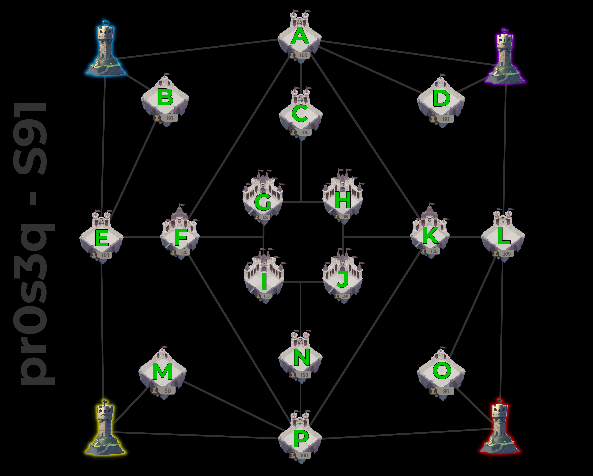
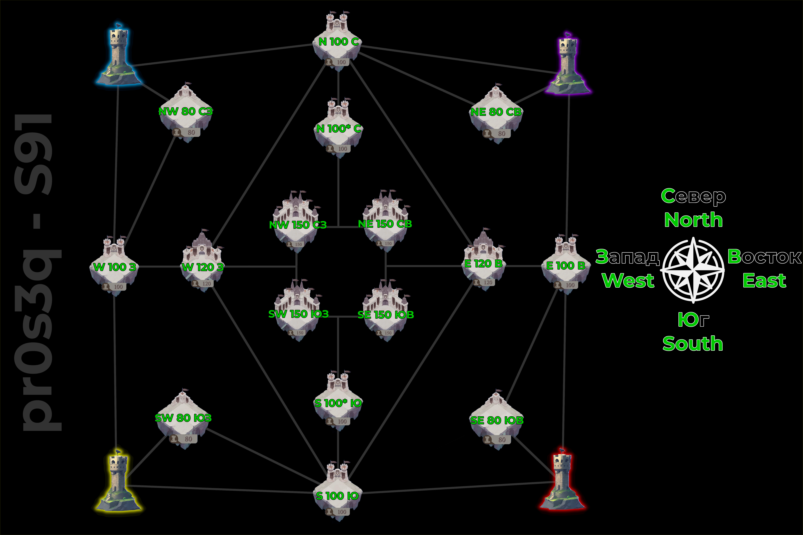
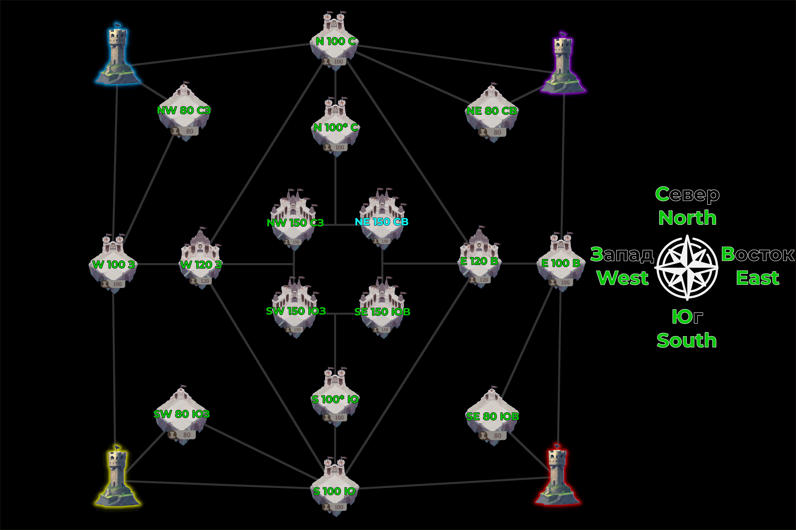
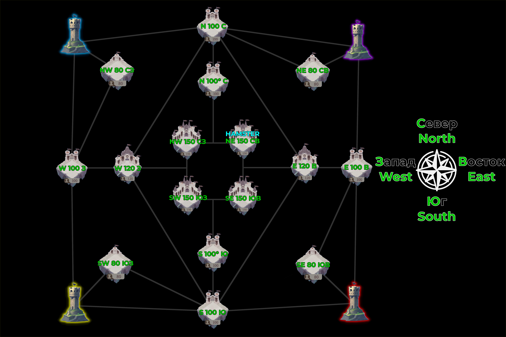

# Files
This repository contains `.xcf` files and `.jpg` files.

`.xcf` files are GIMP (GNU Image Manipulation Program - free software), that you can freely modify to your needs.

`.jpg` files are already exported images.

With GIMP files, you have all layers and other stuff that I used, in order to create those images, so you have more data to freely modify.

# Templates
### Alphabet map

### Greek and Cyrillic alphabet

### Greek and Cyrillic alphabet with dash character between

### Greek and Cyrillic map with compass

### Greek and Cyrillic map with compass - Hamster idea 1
The castle, where hamster is, is different color (turquise)

### Greek and Cyrillic map with compass - Hamster idea 2
The castle, where hamster is, have additional text "HAMSTER" with different color (turquise)

# Tips & Tricks

# Guide
[Guide](docs/guide.md)