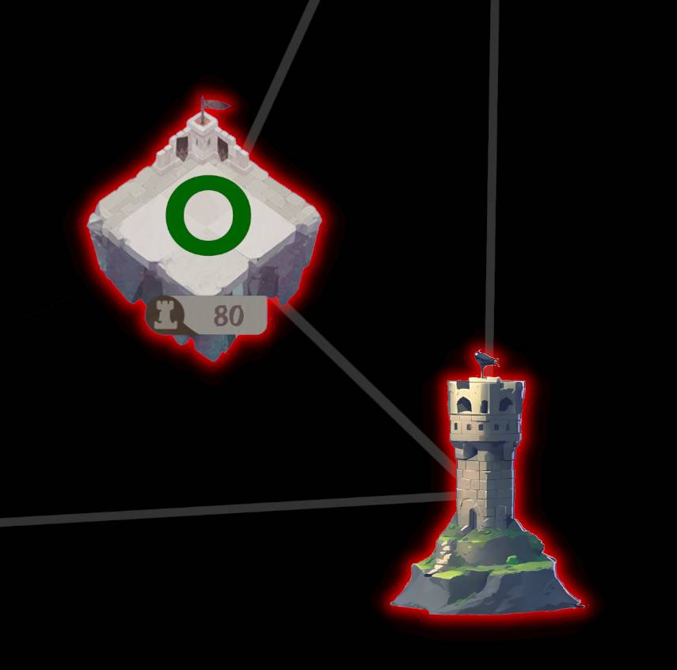
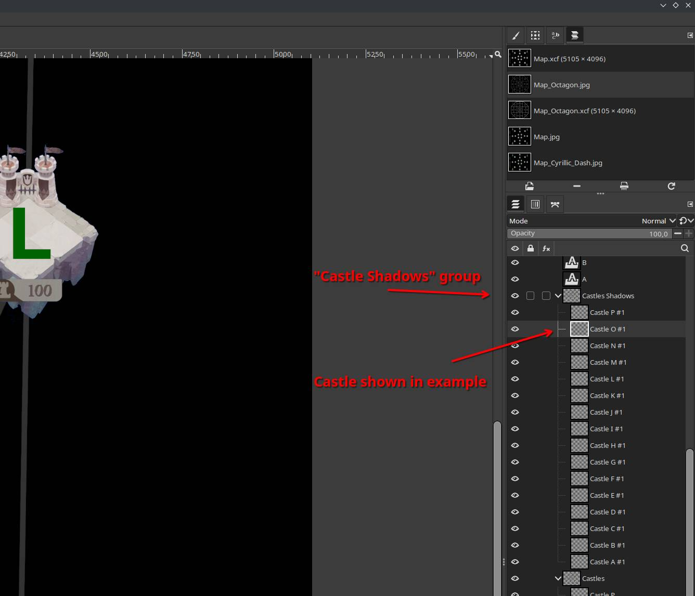
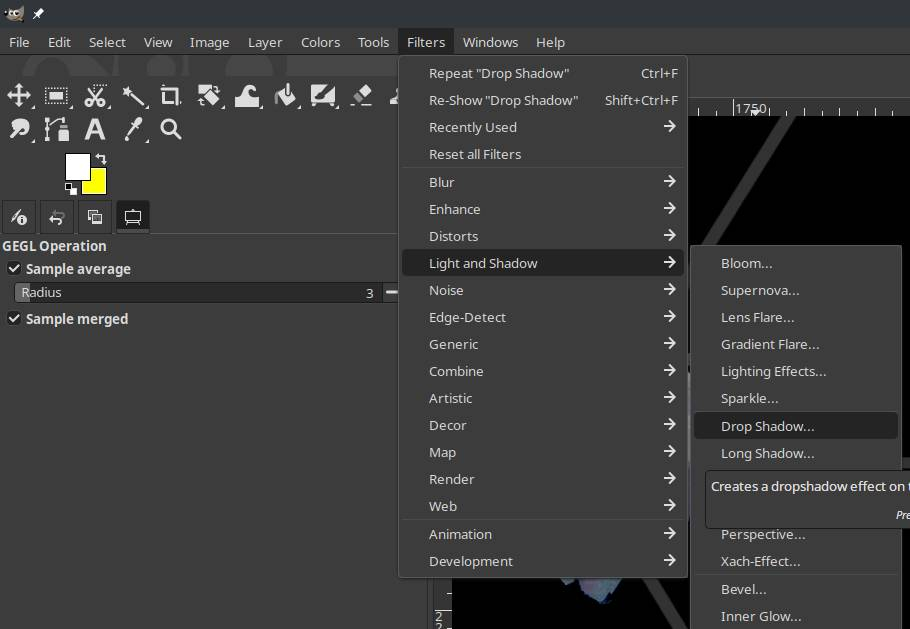
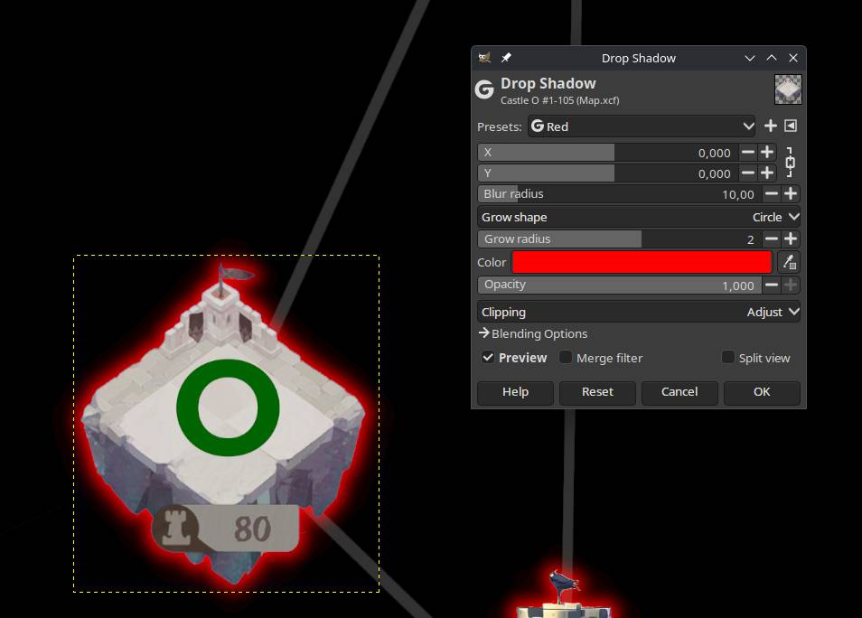

# Guide
### Make shadow marks on taken castles
Lets consider the following scenario. You are starting as RED team, and you take castle 80 right above your starting castle.

`.xcf` file contains "Castles Shadow" group, with duplicate castles. You need to select the castle to which you want to add shadow (in out case it is gonna be "Castle O #1"). Then go to `"Filters" -> "Light and Shadow" -> "Drop Shadow"`

"Drop Shadow" you can mess around, and configure however you want. Here are the options that I am using
- X - 0
- Y - 0
- Blur radius  -10
- Grow shape - circle
- Grow radius - 2
- Opacity - 1.0

Colors:
- Red - #ff0000 (255, 0, 0)
- Purple - #b400ff (180, 0, 255)
- Blue - #00b4ff (0, 180, 255)
- Yellow - #ffff00 (255, 255, 0)

And you are done :)